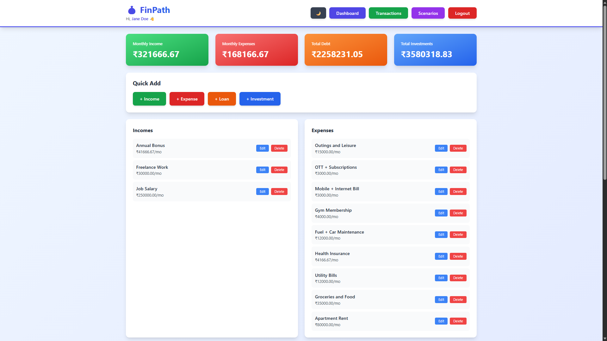
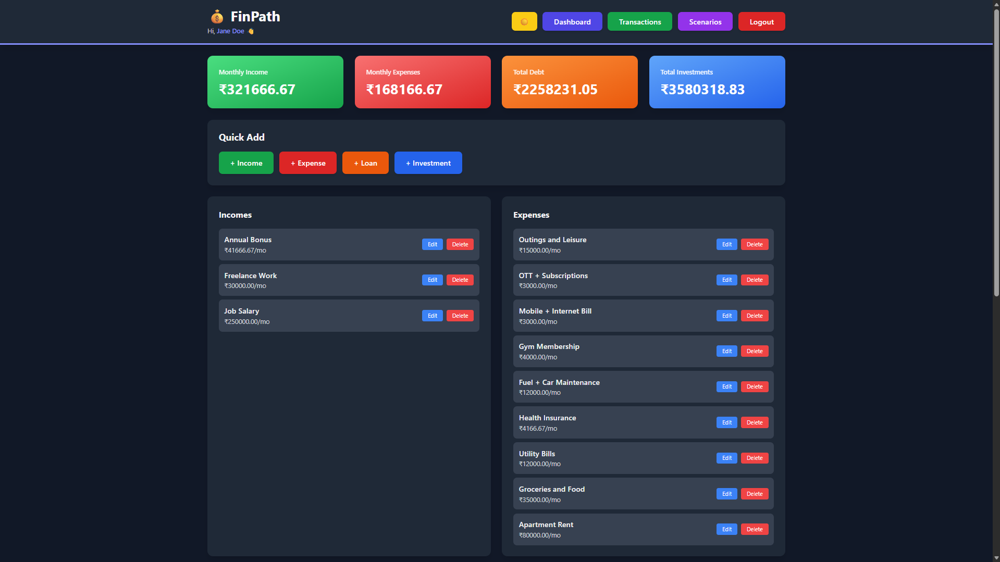
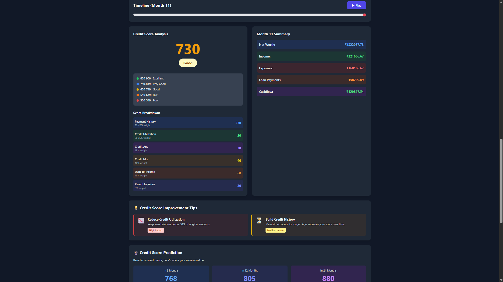
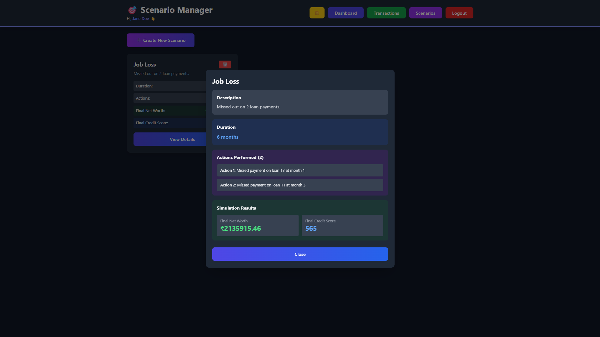

# 💰 FinPath - Personal Finance & Credit Score Simulator


> A full-stack web application designed to help Indians understand how their financial decisions impact credit scores and net worth through realistic month-by-month simulations.

---

## 📖 Table of Contents

- [Features](#-features)
- [Tech Stack](#-tech-stack)
- [Screenshots](#-screenshots)
- [Getting Started](#-getting-started)
- [Project Structure](#-project-structure)
- [Credit Scoring Algorithm](#-credit-scoring-algorithm)

---

## ✨ Features

### 🎯 Core Functionality
- **Realistic Indian Credit Scoring** (300-900 range, CIBIL-style)
  - 7-factor credit model with proper weightings
  - Payment history (35-40%), utilization (20-25%), credit age (15%), mix (10%), DTI (10%), inquiries (5%), recovery (5%)
  - Month-by-month credit score tracking with detailed breakdowns

### 📊 Financial Management
- **Income & Expense Tracking** - Monthly and annual frequencies
- **Loan Management** - Precise amortization using industry formula: `P * r / (1-(1+r)^-n)`
- **Investment Tracking** - Compound monthly returns with contributions
- **Net Worth Calculation** - Real-time assets vs liabilities

### 🔮 Simulation & Planning
- **Deterministic Month-by-Month Simulation** - Up to 360 months (30 years)
- **What-If Calculator** - Instant impact projections without full simulation
- **Scenario Management** - Save and compare multiple financial strategies
- **Action Simulation** - Missed payments, lump sum payments, income changes

### 📈 Visualizations
- **Interactive Timeline** - Play/pause through months
- **Credit Score History Chart** - Track score progression
- **Net Worth Growth Chart** - Visualize wealth accumulation
- **Loan Payoff Timeline** - Progress bars with payoff dates
- **Credit Score Prediction** - 6, 12, 24-month projections

### 💡 Smart Features
- **Personalized Credit Tips** - AI-driven improvement suggestions
- **Transaction Log** - Complete financial history with CSV export
- **Dark Mode** - Eye-friendly interface toggle
- **Reset to Original** - Test multiple scenarios easily

---

## 🛠 Tech Stack

### Backend
- **Runtime:** Node.js 16+
- **Framework:** Express.js
- **ORM:** Sequelize
- **Database:** MySQL 8.0+
- **Authentication:** JWT + bcrypt
- **Validation:** Express-validator

### Frontend
- **Framework:** React 18
- **Build Tool:** Vite
- **Styling:** Tailwind CSS
- **Charts:** Recharts
- **HTTP Client:** Axios
- **Routing:** React Router DOM

### Development
- **Version Control:** Git
- **Package Manager:** npm
- **Code Style:** ESLint (optional)
- **Database Migrations:** Sequelize CLI

---

## 📸 Screenshots

### Dashboard - Light Mode


### Dashboard - Dark Mode


### Credit Score Analysis


### Transaction Log


### Scenario Manager


---

## 🚀 Getting Started

### Prerequisites

Ensure you have the following installed:
- **Node.js** v16 or higher ([Download](https://nodejs.org/))
- **MySQL** v8.0 or higher ([Download](https://dev.mysql.com/downloads/))
- **Git** ([Download](https://git-scm.com/))

### Installation

#### 1. Clone the Repository
```bash
git clone https://github.com/yourusername/FinPath.git
cd FinPath
```

#### 2. Database Setup
```sql
mysql -u root -p
CREATE DATABASE finance_simulator;
EXIT;
```

#### 3. Backend Setup
```bash
cd backend
npm install

# Create .env file
cat > .env << EOF
PORT=3001
DB_HOST=localhost
DB_USER=root
DB_PASSWORD=your_mysql_password
DB_NAME=finance_simulator
JWT_SECRET=your-super-secret-jwt-key-change-in-production
NODE_ENV=development
EOF

# Run migrations
npm run migrate

# Seed demo data
npm run seed

# Start backend server
npm start
```

Backend will run on `http://localhost:3001`

#### 4. Frontend Setup (New Terminal)
```bash
cd frontend
npm install

# Create .env file
cat > .env << EOF
VITE_API_URL=http://localhost:3001
EOF

# Start frontend dev server
npm run dev
```

Frontend will run on `http://localhost:5173`

#### 5. Access the Application
- Open browser to `http://localhost:5173`
- **Demo Credentials:**
  - Email: `demo@example.com`
  - Password: `Demo123!`

---

## 📁 Project Structure
```
FinPath/
├── backend/
│   ├── config/
│   │   └── database.js              # Database configuration
│   ├── migrations/
│   │   └── 20240101000000-create-tables.js
│   ├── models/
│   │   ├── index.js                 # Model associations
│   │   ├── User.js
│   │   ├── Profile.js
│   │   ├── Income.js
│   │   ├── Expense.js
│   │   ├── Loan.js
│   │   ├── LoanPayment.js
│   │   ├── Investment.js
│   │   ├── Transaction.js
│   │   ├── Scenario.js
│   │   ├── CreditRule.js
│   │   └── CreditHistory.js
│   ├── routes/
│   │   ├── auth.js                  # Authentication routes
│   │   ├── incomes.js               # Income CRUD
│   │   ├── expenses.js              # Expense CRUD
│   │   ├── loans.js                 # Loan CRUD
│   │   ├── investments.js           # Investment CRUD
│   │   ├── transactions.js          # Transaction queries
│   │   ├── simulate.js              # Simulation engine endpoint
│   │   ├── scenarios.js             # Scenario management
│   │   └── creditRules.js           # Credit rules config
│   ├── services/
│   │   └── simulationEngine.js      # Core simulation logic
│   ├── middleware/
│   │   └── auth.js                  # JWT verification
│   ├── seeders/
│   │   └── seed.js                  # Demo data seeder
│   ├── .env.example
│   ├── .sequelizerc
│   ├── package.json
│   └── server.js                    # Express server entry
│
├── frontend/
│   ├── src/
│   │   ├── components/
│   │   │   ├── Dashboard.jsx        # Main dashboard
│   │   │   ├── Login.jsx            # Login page
│   │   │   ├── Register.jsx         # Registration page
│   │   │   ├── TransactionLog.jsx   # Transaction history
│   │   │   └── ScenarioManager.jsx  # Scenario management
│   │   ├── services/
│   │   │   └── api.js               # Axios API client
│   │   ├── App.jsx                  # Main app component
│   │   ├── main.jsx                 # React entry point
│   │   └── index.css                # Global styles
│   ├── public/
│   ├── .env.example
│   ├── index.html
│   ├── package.json
│   ├── tailwind.config.js
│   ├── postcss.config.js
│   └── vite.config.js
│
├── screenshots/                      # App screenshots
├── README.md
└── LICENSE
```

---

## 🧮 Credit Scoring Algorithm

### Indian Credit Score Model (300-900)

Algorithm mirrors the CIBIL scoring system used in India:
```javascript
score = base + (payment_history × 0.40) + (utilization × 0.25) + 
        (credit_age × 0.15) + (credit_mix × 0.10) + 
        (debt_to_income × 0.10) + (recent_inquiries × 0.05) + 
        (recovery × 0.05)
```

### Factor Breakdown

#### 1. Payment History (35-40%)
- **Perfect payments:** +200 points
- **Missed payment:** -40 to -60 points
- **Consecutive on-time:** Bonus points
- **Recovery:** 6-12 months to rebuild

#### 2. Credit Utilization (20-25%)
- **< 30%:** Excellent (+150 points)
- **30-50%:** Good (+100 points)
- **50-75%:** Fair (+50 points)
- **> 90%:** Poor (0 points)

#### 3. Credit Age (15%)
- **7+ years:** +100 points
- **5-7 years:** +85 points
- **3-5 years:** +70 points
- **< 1 year:** +15 points

#### 4. Credit Mix (10%)
- **Secured + Unsecured:** +60 points
- **Only secured:** +40 points
- **Only unsecured:** +20 points

#### 5. Debt-to-Income Ratio (10%)
- **< 35%:** +60 points
- **35-50%:** +40 points
- **50-70%:** +15 points
- **> 70%:** 0 points

#### 6. Recent Inquiries (5%)
- **0 inquiries:** +30 points
- **Each inquiry:** -10 points

#### 7. Recovery Bonus (5%)
- **24+ months clean:** +30 points
- **18-24 months:** +20 points
- **12-18 months:** +10 points

### Score Categories
- **850-900:** Excellent (Ideal borrower)
- **750-849:** Very Good (Low risk)
- **650-749:** Good (Needs consistency)
- **550-649:** Fair (Risky borrower)
- **300-549:** Poor (Missed payments/defaults)

---